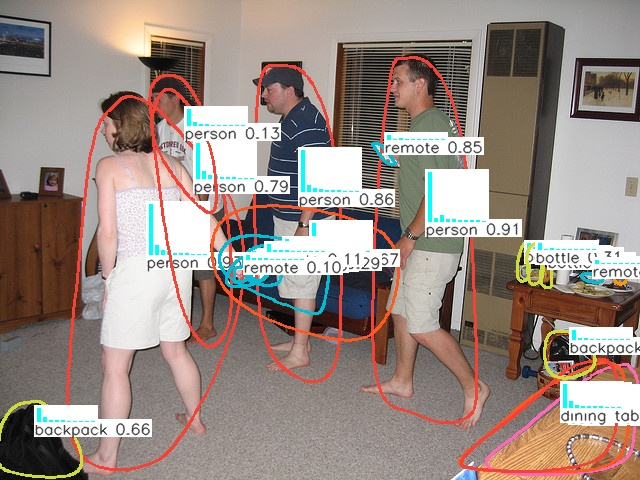
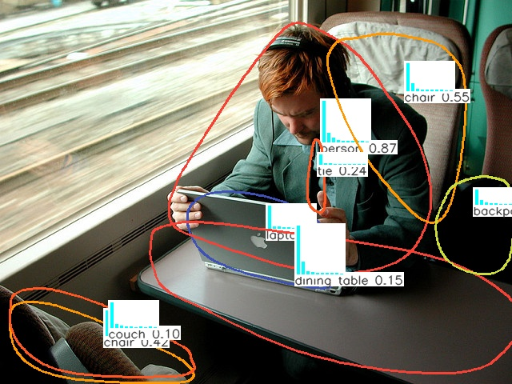
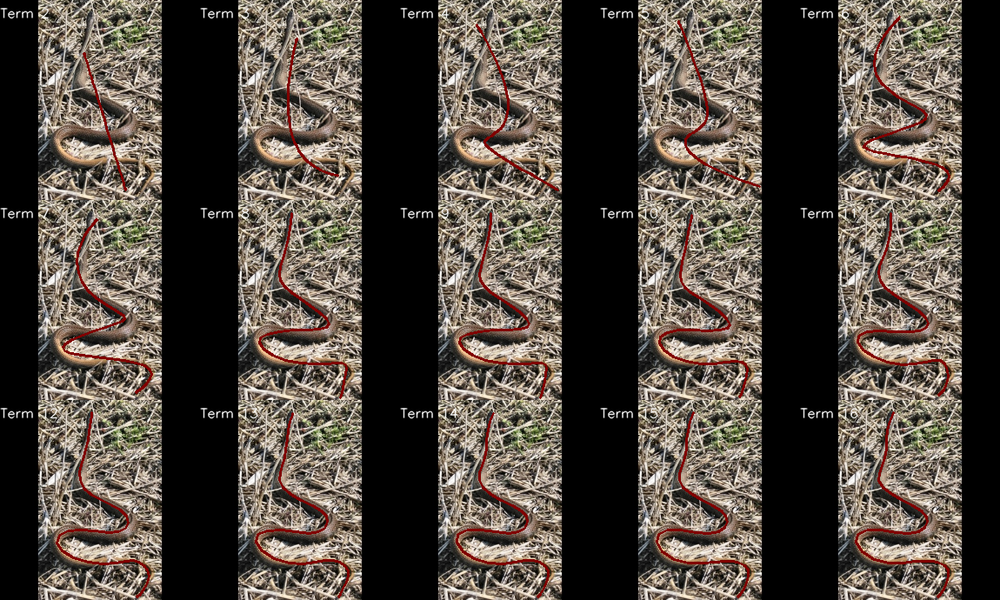
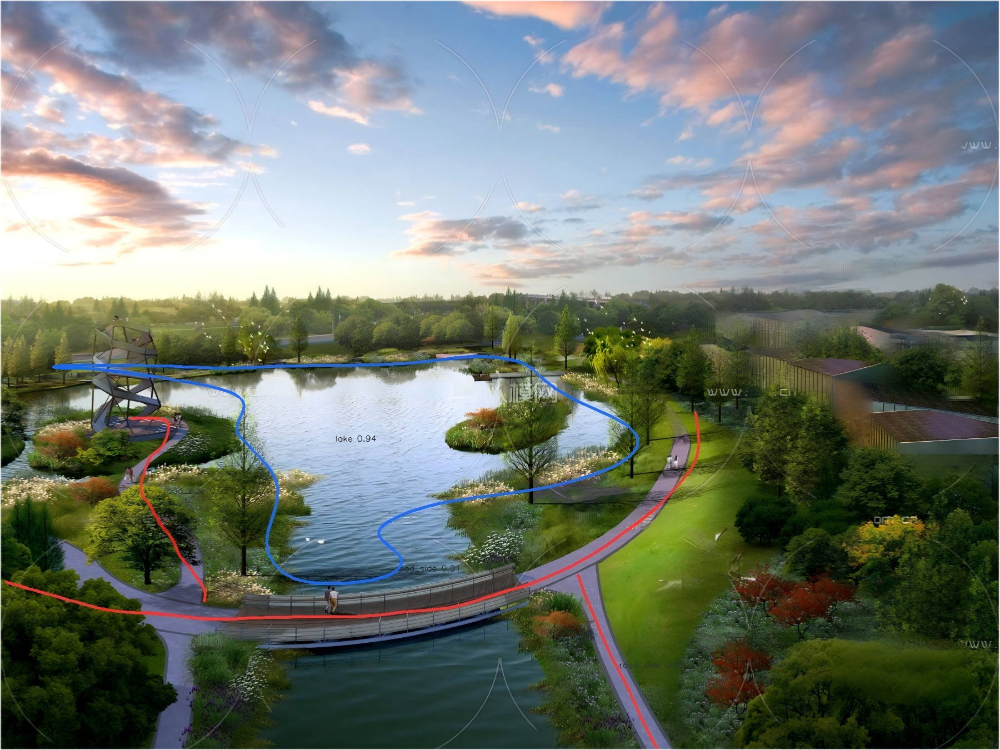
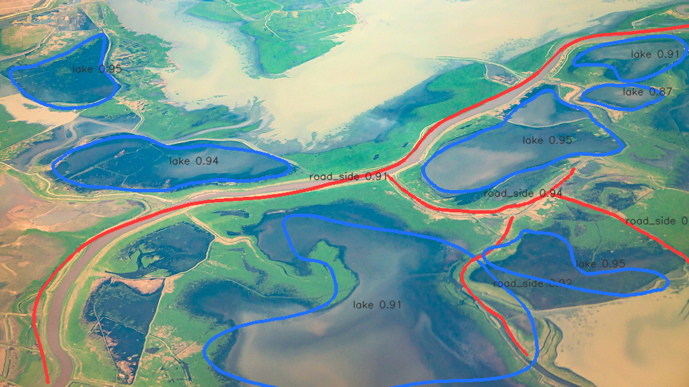
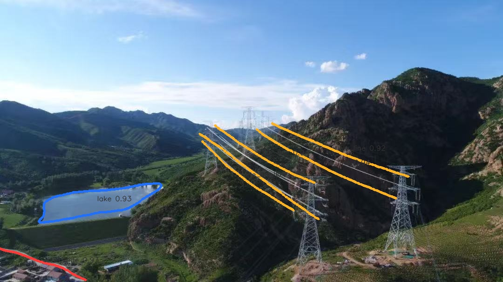
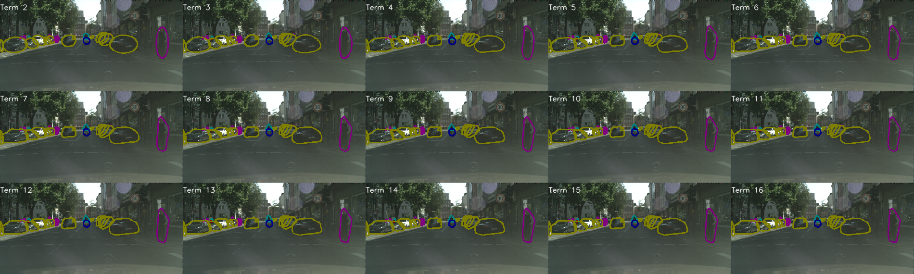
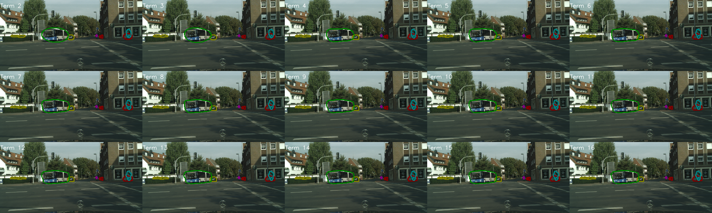
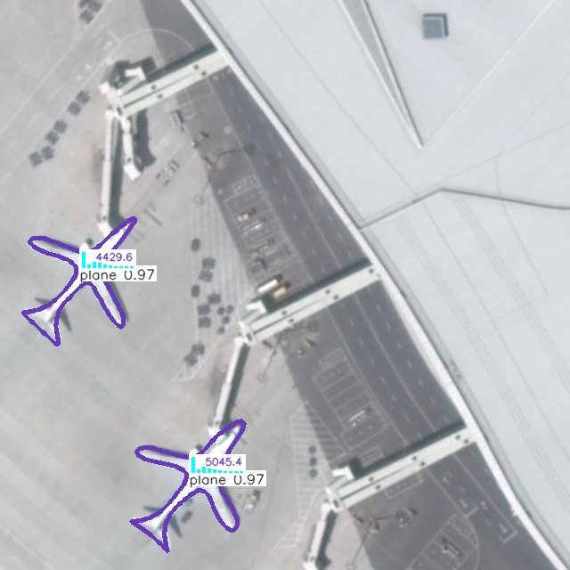
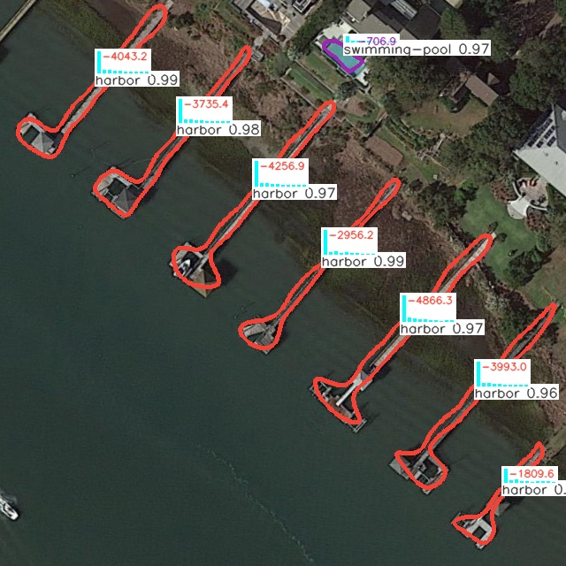

# UFMDet
UFMDet is a Fourier series-based object detection model, designed to detect objects of arbitrary shapes in complex environments. Unlike traditional object detection, UFMDet outputs a semantic equation constructed from the Fourier series of the target, providing a more precise and detailed description of the object. UFMDet is a unified Fourier-based framework that formulates arbitrary-shaped object detection as continuous curve regression in a shared frequency-domain space.

The key idea is to represent closed-shape and line-like objects within a single model, where line-like structures are treated as a constrained degenerate case of closed Fourier curves. As a result, UFMDet can simultaneously detect blob-like and line-like objects within a single image using a unified representation and prediction pipeline. To address parameterization ambiguity, we introduce an equivalence-aware alignment strategy that resolves traversal direction, phase shifts, and endpoint ordering, enabling supervision in the equivalence space and improving optimization stability.

Paper information:
```bibtex
@article{FourierDetByJinLiu,
    author  = "Jin Liu; Huan Li; Zhenfeng Shao",
    title   = "UFMDet: Unified Fourier Multi-shape Detection for Blobs and Lines in Natural Scenes",
    year    = "January 9, 2026",
    journal = "IEEE Transactions on Pattern Analysis and Machine Intelligence",
}
```
You can contact us through:
- Tel,WeChat:13397188592
- QQEmail:41038331@qq.com

Thanks for everyone's contributions.

Project Start Date: October 2024.9
Repository Upload Date: January 2026.5.11

UFMDet Object Detection Demos
<div align="center">
  
  
  
  
  
  
  
  
  
  
  
</div>

### Inference Visualization
Below is a video demonstration of the model inference on the COCO 2017 dataset:
<video width="640" height="360" controls>
  <source src="https://liujin1975060601.github.io/yolov5-ft/demos/videos/road_person-cars-dog_20250206_00295546.mp4" type="video/mp4">
点击链接播放演示视频，请<a href="https://liujin1975060601.github.io/yolov5-ft/demos/videos/road_person-cars-dog_20250206_00295546.mp4">点击这里播放视频</a>。
</video>
<video width="640" height="360" controls>
  <source src="https://liujin1975060601.github.io/yolov5-ft/demos/videos/road-cars-s_20250205_23160389_20250205_23205007.mp4" type="video/mp4">
点击链接播放演示视频，请<a href="https://liujin1975060601.github.io/yolov5-ft/demos/videos/road-cars-s_20250205_23160389_20250205_23205007.mp4">点击这里播放视频</a>。
</video>

The UFMDet model supports the following four datasets:
coco2017
cityscapes
isAID
mstar
Chikusei
Landslide
snake
river+road
river_lines
remote_curves
dota1.5
hrsc2016
UCAS
infared
TuSimple

### Instructions
- `train.py` starts training  
  (specify the training dataset `data`, model architecture `cfg`, and pre-trained weights `weights`).

- `val.py` starts validation  
  (specify model weights `weights` and dataset `data`).

- `detect.py` starts image or video detection  
  (specify model weights `weights` and the source folder path to be detected `source`).

